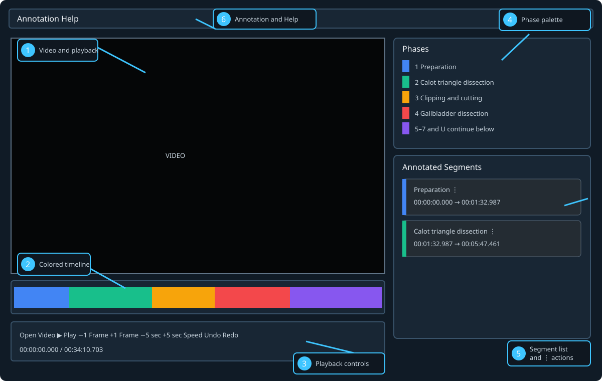

# Phase Annotator User Guide

This guide is for clinicians and research annotators using the Windows one-folder application. Phase Annotator creates continuous temporal phase labels for a local surgical video and saves them automatically beside that video.



1. **Video area:** displays the selected video.
2. **Timeline:** displays the complete annotation as phase-coloured intervals. Click to select and seek; drag an internal boundary to correct it.
3. **Playback controls:** open, play/pause, step approximately one frame, jump five seconds, change speed, Undo, and Redo.
4. **Phase palette:** lists the configured phases, colours, and hotkeys; click a phase or press its hotkey.
5. **Segment list:** describes the same intervals as the timeline. Click a card to select/seek; right-click or use **⋮** for corrections.
6. **Menus:** **Annotation** contains video notes and completion; **Help** shows controls and shortcuts.

## Install and launch

1. Download the complete Phase Annotator ZIP supplied by the project.
2. Extract the ZIP to a normal writable folder. Do not run it from inside the ZIP.
3. Keep `PhaseAnnotator.exe` and the `_internal` folder together.
4. Double-click `PhaseAnnotator.exe`. Administrator rights and a separate Python installation are not required.
5. Enter your first name. It is stored in lowercase as the identity for this application run.
6. Select the required procedure. The selection remains fixed until the application is restarted.

Do not select a different procedure merely to bypass an error. A video with an existing sidecar must be opened using the ontology named by that sidecar.

## Start or resume a video

1. Select **Open Video** and choose an MP4, AVI, MKV, or MOV file.
2. Wait for **Loaded** in the status bar. Playback and annotation remain disabled if loading fails.
3. For a new video, the timeline begins with the configured first phase covering the whole duration.
4. For a previously annotated video, the adjacent JSON sidecar loads automatically and playback resumes near its saved checkpoint.

The canonical annotation is named:

```text
<complete video filename>.phase-annotations.json
```

For example, `case01.mp4` uses `case01.mp4.phase-annotations.json`. Keep the video and sidecar together when moving or backing up work. Do not edit the JSON while the application has that video open.

## Playback and navigation

| Control | Behavior |
| --- | --- |
| **Play/Pause** or Space | Start or pause playback |
| Left/Right arrow | Step by an estimated frame interval |
| **−5 sec / +5 sec** | Jump five seconds |
| Speed | Select 1×, 2×, 4×, 8×, or 12× |
| Seek slider | Move to a time in the video |
| Timeline click | Select the interval and seek to that position |
| Segment-card click | Select the interval and seek to its start |

Displayed frame numbers and one-frame steps are timestamp-derived estimates, especially for variable-frame-rate video. Milliseconds are the authoritative stored boundary unit.

## Record phases

While the video is at the desired transition:

- press the hotkey shown beside the phase; or
- click the phase in the right-hand palette.

Both perform the same validated operation. The selected phase begins at the playhead, coverage remains continuous, and equal adjacent phases are combined. `U` records **Undefined** for footage that cannot be assigned appropriately.

Phase keys are deliberately inactive while typing or while keyboard focus remains in the segment list. Click the video controls or timeline to restore the normal annotation context.

## Correct an annotation

Select the segment using the timeline or segment list. Then right-click its card or choose **⋮**:

- **Edit note:** add an interval-specific explanation.
- **Change phase:** relabel the complete selected interval.
- **Set start/end to playhead:** move the shared boundary to the current time.
- **Convert to Undefined:** retain coverage but mark the interval unresolved.
- **Merge left/right:** adopt the neighbouring phase and combine intervals.

Unavailable operations are greyed out. Pressing Delete converts the selected segment to Undefined. It does not leave a hole in the timeline.

Drag an internal timeline boundary for direct correction. Cyan preview means valid; red means invalid. Release to commit, or press Escape to cancel.

Use **Undo/Redo**, `Ctrl+Z`, `Ctrl+Shift+Z`, or `Ctrl+Y` for annotation changes made during the current application/video session. Undo history is not restored after closing or loading another video.

## Notes, completion, and reopening

- Use **Annotation → Edit video note...** for a note about the complete video.
- Use the segment **⋮** menu for a note about one interval.
- Use **Annotation → Mark complete...** only after reviewing the displayed summary and Undefined footage.

A completed annotation is read-only. To correct it, use **Annotation → Reopen for editing...** and confirm. The application archives the completed record before returning it to Draft.

Completion is an explicit workflow declaration, not proof that every clinical decision is correct.

## Automatic saving and history

There is no routine Save button. The canonical JSON is written automatically after successful annotation changes, Undo/Redo, completion, and reopening. Resume position is checkpointed during normal use.

`[UNSAVED]` in the title means memory contains work that could not be written. Do not close casually: use the offered retry/discard/cancel choice and resolve permissions or disk problems. A changed session creates a timestamped local history snapshot on clean close or video replacement; history is recovery assistance, not a regulated audit log.

## Errors and safe responses

- **Wrong procedure:** restart and choose the procedure named in the message. The existing JSON is left unchanged.
- **Invalid sidecar:** preserve the JSON and report the message; do not delete it merely to continue.
- **Media/codec failure:** try an approved H.264 MP4 copy or report the file details. Never overwrite the original clinical video during conversion.
- **External-change warning:** another process changed the sidecar. Stop and reconcile the files rather than forcing an overwrite.
- **Read-only folder:** move an authorised working copy to a writable location; the application intentionally has no hidden fallback save directory.

## Privacy and collaboration

- Do not put patient identifiers in filenames, notes, screenshots, or examples.
- The application supports sequential identifiable annotators, not simultaneous editing.
- Avoid opening the same video/sidecar for editing on multiple computers.
- The annotator name, local source path, timestamps, and editing attribution are persisted in the JSON.

Use **Help → Shortcuts and controls...** for the in-application summary.
